# Fault-tolerant university backend

Implemented and deployed to the local `orbstack` Kubernetes context on 2026-10-05. This report describes the final application, the selected fault-tolerance mechanisms, and the measured experiments. The approved design and implementation plan remain in Git history; the [execution plan](docs/plans/2026-10-05-university-backend-implementation.md) records the delivery checkpoints.

## 1. Purpose and assignment coverage

The backend manages course enrollment, paid course purchases, one-file assignment submissions, grading, and student reports. It demonstrates availability during selected stateless failures and recovery of accepted asynchronous work. The supplied five-page `MIDTERM FTR.docx.pdf` calls for independent services/modules, infrastructure and software fault tolerance, controlled experiments, dependability calculations, and at least three failure/recovery demonstrations.

The application has three separately deployed processes with distinct responsibilities: the HTTP API, Supervisor-managed payment workers/outbox relay, and the mock payment HTTP service. MySQL, queue Redis, cache Redis, RustFS, Envoy, and monitoring run as separate workloads. One Symfony codebase supplies the domain model and prevents duplicate implementations from diverging.

| Requirement | Implementation / evidence |
| --- | --- |
| PHP 8.3 / RoadRunner | Pinned Docker base, `.rr.yaml`, two PHP HTTP workers per pod |
| API Platform / generated Swagger | Explicit DTO resources and state providers/processors; `/api/docs.html`; exported OpenAPI |
| Doctrine ORM / MySQL | Attribute entities, ORM repositories and pessimistic locking; one final flush per transactional handler |
| Admin course/assignment/grade CRUD | Role checks, validation, soft archive for courses/assignments, physical grade deletion |
| Student enrollment / purchase | Free enrollment; asynchronous mock checkout with idempotency |
| Exactly one file, any format, max 10 MB | One multipart `file` field, exact 10,000,000-byte limit, private RustFS object, unique submission |
| PDF reports by students | Escaped Twig HTML, local Dompdf fonts, enrollment/assignment rows and recorded-grade averages |
| Queue / caching / process control | Separate Redis workloads, Symfony Messenger, Supervisor, bounded receiver restarts |
| Kubernetes / Helm / Envoy | Baseline and resilient releases, persistent volumes, Gateway API routes |
| Grafana / RoadRunner dashboard / vlogs | Official dashboard adaptation, Prometheus, VictoriaLogs collector and datasource |
| LoggerInterface / Monolog | PSR logger backed by Monolog; JSON stderr, request IDs carried into payment jobs |
| Fault evaluation | Three repetitions per availability/queue/checkpoint scenario; raw JSON and CSV; verified backup restore |

## 2. Selected architecture and alternatives

Option A was selected: replicated stateless workloads, single persistent stateful instances, durable outbox/reconciliation, and tested backup restore. It fits a local assignment demonstration and makes the remaining failure domains explicit.

| Option | Benefit | Cost / limitation |
| --- | --- | --- |
| **A — selected**: API/gateway/worker replicas + durable outbox + backups | Small deployment, pod continuity, reliable queued work recovery | MySQL, Redis and RustFS availability still depends on one instance and one node |
| B: distributed RustFS + stronger storage replication | Better storage continuity across storage-process failures | More disks/pods; one Mac still remains a shared failure domain |
| C: MySQL and Redis automatic failover, multi-node storage | Stateful service continuity | Operators, quorum, fencing, more resources and operational testing |

The local cluster has one node. Two replicas cannot preserve availability when that node or Mac fails. Backups on the same physical host establish snapshot recovery, not protection from destruction of the host. Alternatives B/C are documented choices, not deployed capabilities.



Editable source: [architecture.mmd](docs/architecture.mmd). Portable raster: [architecture.png](docs/architecture.png). `scripts/render-architecture.sh` uses Mermaid CLI 12.0.0 to regenerate both artifacts.

The diagram shows the resilient application. The baseline uses the same schema and code in `midterm-baseline`, with its own single API/gateway/worker and separate stateful storage. Monitoring is shared in `midterm-monitoring`; Envoy controllers/proxies run in `midterm-gateway`.

## 3. Data model and integrity

| Entity / table | Main fields and constraints |
| --- | --- |
| User / `users` | Integer ID; unique login; display username; password hash; administrator flag; UTC creation time |
| Course / `courses` | Integer ID; name; nullable integer price; creation/update/archive timestamps; nonnegative price check |
| Assignment / `assignments` | ID; name; course FK; description; UTC deadline; creation/update/archive timestamps |
| CourseEnrollment / `enrollments` | User/course FKs; source `free` or `paid`; optional purchase FK; unique user/course pair |
| Submission / `submissions` | Assignment/user FKs; opaque object key; safe original filename; byte size; SHA-256; timestamp; unique assignment/user pair |
| Grade / `grades` | Assignment/user FKs; integer grade 0–100; optional comment; timestamps; unique assignment/user pair |
| CoursePurchase / `purchases` | User/course; snapshotted amount/currency; status; JSON **array** metadata; idempotency key/fingerprint; processing lease |
| PaymentAttempt / `payment_attempts` | Purchase/attempt number; status; timestamps; next retry; provider reference/error; duration; unique purchase/attempt pair |
| OutboxMessage / `outbox` | Purchase association in `aggregate_id`; type/payload; availability/publication timestamps; delivery count; expiring publication lease |
| MockPaymentReceipt / `mock_receipts` | Unique purchase and provider reference; amount/currency; durable successful mock payment record |
| PaymentCircuitState / `payment_circuit` | Shared provider state; consecutive failures; open-until and half-open probe lease |

All prices are integer USD cents; null or zero is free. Checkout snapshots the price so later edits cannot change an accepted transaction. Foreign keys retain historical associations. Courses and assignments archive rather than cascade-delete student/payment records. Historical administrator reports include archived assignments. The migration adds database checks for price, grade, file-size, attempt bounds, and array-shaped purchase metadata.

The application uses Doctrine ORM entities and repository classes for all business reads/writes, reporting, authorization checks, payment recovery, metrics and restore comparisons. Repository `save()` calls `persist()` only; repositories never flush. `Persistence/Transaction::run()` opens a transaction, runs the handler/command work, flushes exactly once, and commits before returning. Exceptions roll back and clear the unit of work. API processors and upload/mock controllers use this boundary; demo seeding stages the full graph and flushes once before reporting generated IDs. Doctrine entities and serializer inputs remain mutable; stable service classes are readonly, and command constructor dependencies are readonly properties.

Payment claim, settlement, outbox claim/publication and reconciliation have separate handler boundaries. The orchestrating Messenger handler makes the external payment call between claim and settlement, preserving the durable attempt and crash checkpoints. Settlement commits the attempt result, purchase status, enrollment/retry outbox and circuit update together. The relay flushes each short handler batch and clears its EntityManager per iteration; it resets the manager after dependency failures. Lock acquisition uses ORM queries with `PESSIMISTIC_WRITE` and `HINT_REFRESH` so the identity map cannot hide concurrent settlement. The relay now uses blocking pessimistic locks instead of vendor-specific `SKIP LOCKED`; this retains delivery safety, with potential serialization of concurrent relay claims.

An outbox message holds a purchase association mapped to the existing `aggregate_id` column. Doctrine orders purchase/outbox inserts in one flush, so no intermediate ID-generation flush is needed. Migration `Version20261007223818` adds the corresponding foreign key without changing the stored IDs. Restore verification builds ordered, normalized entity snapshots through ORM metadata; current/restored hashes share this representation. Backup dump/import remains a database administration operation, and isolated database creation uses Doctrine's schema manager. Migration DDL remains in migration classes. See [Doctrine transaction demarcation and locking](https://www.doctrine-project.org/projects/doctrine-orm/en/current/reference/transactions-and-concurrency.html).

Critical enrollment, checkout, settlement and upload metadata transactions acquire database locks in user → course → assignment/purchase order where applicable. Unique keys remain the final concurrent-write guard. Grade creation requires a submission. A course with an active purchase cannot be edited or archived.

## 4. Authentication and API contract

JWT authentication is stateless. Login is the identity claim; `username` remains a display name. Passwords use Symfony's password hasher. Registration cannot set administrator privileges. Seeds provide local demo accounts: `admin` / `AdminPass123!`, and `student` or `other` / `StudentPass123!`.

Public routes are registration, login, the active course catalogue, API docs and health checks. Student records are filtered by the authenticated user; administrator access is explicit. Another student's purchase, submission metadata, or file download returns 404. Input DTOs reject undeclared fields. JSON errors use problem responses, and server/dependency errors omit internal details.

| Method / route | Access / behavior |
| --- | --- |
| POST `/api/register`, POST `/api/login` | Public account creation / JWT login |
| GET `/api/me` | Current authenticated identity |
| GET `/api/courses`, `/api/courses/{id}` | Public active catalogue |
| POST/PATCH/DELETE `/api/courses[/<id>]` | Administrator CRUD/archive |
| GET `/api/courses/{courseId}/assignments`, `/api/assignments/{id}` | Enrolled student or administrator |
| POST/PATCH/DELETE `/api/assignments[/<id>]` | Administrator CRUD/archive |
| POST `/api/courses/{id}/enroll` | Authenticated free enrollment; repeated enrollment returns the existing record |
| POST `/api/courses/{id}/purchase` | Authenticated paid checkout; required `Idempotency-Key` |
| GET `/api/purchases`, `/api/purchases/{id}` | Owner / administrator; includes durable attempt outcomes |
| GET `/api/enrollments`, `/api/submissions` | Current student / administrator records |
| POST `/api/assignments/{id}/submit` | Enrolled student; exactly one file; deadline enforced |
| GET `/api/submissions/{id}/download` | Owner / administrator private attachment |
| GET/POST/PATCH/DELETE `/api/grades[/<id>]` | Students read their grades; administrators mutate |
| GET `/api/courses/{id}/report` | Administrator PDF export |

Collections use pages of 20 records (`?page=N`). Standard API Platform metadata generates resource schemas/operations. An OpenAPI decorator documents the three multipart/binary controller routes and checkout header. [openapi.json](output/openapi/openapi.json) is exported from those same metadata/services, not maintained as a separate hand-written contract.

Paid checkout returns HTTP 201 with a **pending purchase resource**; payment completion is asynchronous. Poll its GET endpoint. Repeating the same user/idempotency key/body returns the same purchase. Changing the course/fixture/beneficiary with an existing key conflicts. Concurrent distinct keys cannot create two active purchases for the same user/course.

## 5. Payment DTO, fixtures and background processing

`PaymentServiceInterface::pay(PaymentDetailsDto, PaymentContext)` receives the required four-field DTO: `beneficiaryName`, `cardNumber`, `expiryDate`, `cvv`. The separate server-created context supplies purchase ID, amount, currency and attempt number. Clients cannot select attempts, amount, status, or a scenario flag.

The fixture catalogue and outcome switch are hard-coded in `MockPaymentService`; `MockScenarios` handles fixture validation/reconstruction. [Generated example payloads](docs/examples) use that catalogue. Accepted expiry is `12/2035`, CVV `123`, and a nonempty beneficiary name.

| Synthetic card | Scenario | Resilient result / business attempts |
| --- | --- | --- |
| `9900000000000010` | Success | Succeeded / 1 |
| `9900000000000028` | First attempt transiently fails | Succeeded / 2 |
| `9900000000000036` | First two attempts transiently fail | Succeeded / 3 |
| `9900000000000044` | Every attempt transiently fails | Failed / 3 |
| `9900000000000051` | Permanent decline | Declined / 1 |
| `9900000000000069` | Three-second provider delay | Failed / 3, because the caller's deadline is two seconds |

These are synthetic fixtures. Card number, expiry and CVV are validated at checkout but are never persisted, logged, or placed on Redis. Purchase metadata stores an array containing fixture identity, beneficiary name and correlation ID. Workers reconstruct the synthetic DTO. Unknown details are rejected before acceptance.

1. Checkout locks the user/course, validates eligibility, and commits a purchase plus outbox record atomically.
2. The relay leases due outbox rows using Doctrine pessimistic write locks (short blocking transactions), publishes an ID-only Messenger message, and records publication. A crash after Redis acceptance can cause republication, which is harmless.
3. A worker reserves a durable attempt and a 15-second purchase lease, then calls the provider outside the database transaction with a two-second deadline.
4. The mock service inserts a unique successful receipt **before replying**. Replay of the same purchase returns that receipt.
5. Settlement locks the domain rows, rejects already completed/stale attempt results, updates attempt/purchase state, and creates exactly one enrollment on success.
6. Transient failures schedule the next business attempt after two then four seconds. The initial attempt plus **two retries** is the maximum. Declines finish immediately.
7. Reconciliation finds nonterminal purchases without recent/pending outbox work and republishes them after abandoned processing leases expire. Terminal states are never revived.

Business attempts are independent of Messenger's two infrastructure delivery retries. Redis uses AOF, `appendfsync everysec`, and no eviction; its broker redelivery timeout is 120 seconds. Failed transport is a separate Redis stream. MySQL remains authoritative, so loss of a published broker copy does not lose resilient work.

The MySQL-backed circuit opens after five recorded transient failures for 15 seconds. One half-open probe has a 10-second lease. Deferred purchases consume no new business attempt. Supervisor runs consumer, relay, and metrics processes. A receiver dependency failure restarts with 2/4/8/16/30-second bounded delays rather than exhausting Supervisor's rapid startup retries. Request/job logging carries a request ID; metrics do not label individual users or purchases.

## 6. Files, grades and PDF reports

Uploads accept exactly one multipart field named `file`, with no extra text/file fields. The application checks actual byte size against **10,000,000 bytes**, permits any format, computes SHA-256, and writes to an opaque private S3 key. PHP/RoadRunner/Envoy allow 12 MiB request bodies to accommodate multipart overhead.

After upload, a database transaction rechecks enrollment, active assignment/course, deadline and uniqueness before inserting metadata. On failure it deletes the new object; `app:cleanup-orphans` offers a dry run and `--apply` for unreferenced objects older than 24 hours. No resubmission/replacement is exposed. Downloads stream authenticated attachments as `application/octet-stream` with safe filenames and `nosniff`.

Grades require submitted work and an integer 0–100. Reports use `templates/reports/course.html.twig`, escape names/comments, disable Dompdf remote assets/PHP, and use local DejaVu fonts. Each student/assignment row shows submission and grade status. Missing grades are excluded from student averages. [Deployed sample report](output/reports/deployed-course-report.pdf) was rendered and visually checked.

RustFS storage and MySQL are separate systems; upload compensation and aged orphan cleanup address the gap between object creation and metadata commit. No distributed transaction or replicated RustFS availability is claimed.

## 7. Infrastructure and software fault tolerance

| Mechanism | Failure addressed / scope |
| --- | --- |
| Two API and Envoy replicas, load balancing, pod replacement | One stateless pod/process crash |
| Scheduled dump to private S3 backup bucket + isolated restore | Recovery to a verified database snapshot |
| Persistent MySQL/RustFS/queue volumes | Pod replacement retains data; not node/host replication |
| Transactional outbox + reconciliation | Redis outage/lost message, interrupted publication or worker |
| Unique keys + idempotent receipts/settlement | Duplicate requests/delivery and uncertain provider success |
| Initial payment attempt + two bounded retries | Transient provider failures |
| Dependency deadlines and shared circuit | Slow/unavailable mock provider; limits calls during failure |
| Expiring leases and stale-result guards | Abandoned/concurrent processing without unbounded attempts |
| Cache bypass in resilient profile | Disposable cache failure; authorization remains in MySQL |
| Separate liveness/readiness and bounded restart delays | Avoid dependency-triggered restart storms |
| File compensation, checksums and orphan cleanup | Storage/database partial failure |

Catalogue cache TTL is 30 seconds and mutations invalidate it. Authorization, enrollment and price decisions always use the database. Both profiles use the same two-second payment deadline and basic health probes; resilient differences are replica count, business retries, outbox/reconciliation, circuit, cache fallback, disruption budgets and scheduled backups. Baseline is an experimental comparison profile with direct dispatch after purchase commit and one business attempt.

Envoy applies 15-second overall / 12-second backend request deadlines, a 12 MiB request buffer limit and a local 200-request/second limit per proxy. Gateway automatic retries are disabled for all routes; payment retry decisions remain in the worker. RoadRunner uses two PHP workers per pod, a 500-request recycle limit and a 128 MB worker memory recycle threshold; Symfony reboots the kernel after each HTTP request.

MySQL backups run every 15 minutes with `--single-transaction`, gzip, and a SHA-256 manifest. The backup bucket has a seven-day `mysql/` object expiration rule. Restore creates a new `university_restore_*` database, verifies the compressed checksum, imports the dump, checks record/relationship bounds, and compares ordered row hashes to the current source when quiescent. It never overwrites the application database. A database dump does not copy uploaded objects to independent storage; files still rely on the RustFS volume. Backup and file buckets are separate, but the local demo uses shared RustFS service credentials; separate scoped identities remain a production improvement.

## 8. Deployment, Grafana and operations

`make setup-local` builds a local image, creates/reuses ignored generated secrets, installs Envoy Gateway 1.9.2, deploys baseline/resilient charts, initializes schema/seeds/private buckets, and waits for workloads. Every Kubernetes/Helm operation explicitly selects **orbstack**. OrbStack startup can switch the global default; setup restores the original context immediately afterward. The delivered environment's original `stage-nbg3` context was restored. Existing Argo CD and other workloads are untouched.

| Component | Version / setting |
| --- | --- |
| PHP | 8.3.35 in the pinned container; local test CLI 8.3.27 |
| Symfony / API Platform | 7.4.20 / 4.4.3 (Composer lock) |
| Doctrine ORM / DBAL | 3.7.3 / 4.5.0 |
| RoadRunner / Symfony bundle | 2025.1.15 / 3.4.0 |
| MySQL / Redis | 8.4.8 / 7.4.8 |
| RustFS | 1.0.0-alpha.69, pinned image digest |
| Kubernetes | OrbStack v1.35.6+orb1, single node, `local-path` PVCs |
| Envoy Gateway | Helm v1.9.2 |
| Prometheus / Grafana | 3.5.0 / 12.3.1 |
| VictoriaLogs / collector | v1.53.0; charts 0.13.10 / 0.3.8 |
| Grafana logs datasource | victoriametrics-logs-datasource 0.32.0 |

URLs: [Campus](https://midterm.k8s.orb.local/), [Swagger](https://midterm.k8s.orb.local/api/docs.html), [baseline Swagger](http://baseline.midterm.k8s.orb.local:8080/api/docs.html), [Grafana](http://grafana.midterm.k8s.orb.local:3000). Separate listener ports resolved the observed local load-balancer port conflict. See [README](README.md) for setup commands, generated Grafana password access, seed logins and port-forward alternatives.

The official RoadRunner HTTP dashboard is vendored from `roadrunner-server/docs`, commit `b89c02d11326e7fc66078da3d47910a2f3f1cb25`, `lab/dashboards/http.md`. Its nine panels are retained. Adaptations bind the Prometheus UID, add pod/profile selectors, correct latency milliseconds and memory conversion, and label request rate as requests/second. Upstream raw dashboard canonical SHA-256: `059cf93f008a16bfb5fa7edb3beb4bfb1ea5fad4d78f6159c24a736e740ea2b7`.

Prometheus discovers each annotated application and Envoy pod every five seconds. The application dashboard adds purchase states, outbox backlog/age, attempt counts/duration, database health and circuit state. VictoriaLogs retains seven days; its collector restricts namespaces and uses a bounded 1 GiB disk buffer. Grafana has provisioned Prometheus and VictoriaLogs datasources. The app dashboard includes logs; Explore can query:

```text
kubernetes.pod_namespace:=midterm | unpack_json
| filter (_msg:=payment.attempt_completed OR message:=payment.attempt_completed)
```

RoadRunner wraps PHP JSON logs in its server message; `unpack_json` exposes the inner Monolog fields. Supervisor consumer logs are already JSON. `context.request_id` correlates HTTP and payment events. Body content, passwords, bearer tokens and synthetic card data are omitted from application outcome logging. [Observability evidence](output/evaluation/observability.json) confirms real series, healthy datasources, nine official panels and searchable payment logs.

## 9. Evaluation method and calculations

Host-side Python probes use UTC timestamps and monotonic durations. Availability runs use identical parameters: 0.2-second target probe interval, two-second lead-in, five-second fault period, readiness recovery and five-second tail. One API pod is force-deleted; cache/MySQL workloads are scaled down and deletion verified before restoration. Each profile/scenario is repeated three times, sequentially. The other profile remains deployed but has no test workload. Monitoring scrapes continue.

Raw per-run JSON includes statuses, latency, observed injection boundary and statistics. [requests.csv](output/evaluation/requests.csv), [reliability.csv](output/evaluation/reliability.csv) and [reliability.json](output/evaluation/reliability.json) are generated from those samples. Inventory records deployed images/pod image IDs and configuration hashes. Controlled failures produce empirical short-window statistics, not long-term service predictions.

Let T be observation time, D estimated unavailable time, N observed contiguous outage episodes:

- Request availability = successful expected-200 probes / total probes.
- Sampled time availability = (T − D) / T; each sample's state lasts until the next sample/end.
- MTTR = mean observed outage duration, only when recovery is observed.
- Operating-time MTBF estimate = (T − D) / N; undefined when N = 0.
- MTTF = time from probe start to first failed probe; no-failure runs are right-censored at the observation duration.
- Failure rate = N / T; this is the forced-fault experiment rate.

Request and time availability differ when slow failures reduce probe frequency. Recovery timing is limited by the sampling interval and includes local restart/readiness behavior. Load-test 429 responses are reported separately as admission control, not silently counted as infrastructure failures. Permanent mock declines and ordinary expected 4xx are business outcomes.

## 10. Measured results

| Profile / scenario (3 runs each) | Mean request availability | Failed / total probes | Mean MTTR | Mean operating MTBF | Mean MTTF |
| --- | --- | --- | --- | --- | --- |
| Baseline / api_crash | 82.89% | 31 / 181 | 2.10 s | 10.11 s | 2.24 s |
| Baseline / cache_outage | 31.53% | 141 / 206 | 10.04 s | 4.29 s | 2.24 s |
| Baseline / mysql_outage | 60.77% | 37 / 102 | 13.64 s | 5.16 s | 2.24 s |
| Resilient / api_crash | 100.00% | 0 / 184 | Undefined / censored | Undefined / censored | Undefined / censored |
| Resilient / cache_outage | 100.00% | 0 / 200 | Undefined / censored | Undefined / censored | Undefined / censored |
| Resilient / mysql_outage | 42.15% | 77 / 133 | 15.80 s | 4.55 s | 2.23 s |

The resilient profile had no failed probes during the measured API-pod crashes or cache outages. Both profiles lost database-backed readiness during MySQL outage. The two-API profile did not improve this stateful failure: its mean observed recovery was longer in these short local runs. This is evidence for the remaining database dependency, not a claim that replication solves it. Exact time availability and failure-rate values remain in the linked dataset.

| Recovery demonstration | Observed result |
| --- | --- |
| Baseline: published Redis message deliberately lost | 0/3 recovered; all remained pending at the 25-second post-start observation limit (right-censored) |
| Resilient: published Redis message deliberately lost | 3/3 recovered; every recovered purchase had one receipt, one attempt and one enrollment |
| Resilient worker crash at `after_provider_success` | 3/3 recovered; mean 8.99 s after checkpoint; one receipt/attempt/enrollment each |
| Resilient worker crash at `after_outbox_publish` | 3/3 recovered; mean 8.32 s after checkpoint; one receipt/attempt/enrollment each |
| Queue Redis dependency stopped while accepting a purchase | 3/3 accepted during outage and recovered with one attempt; receiver restart backoff exercised |
| MySQL dump / separate restore | Checksum verified; source/restored records match; zero checked integrity violations |

Checkpoint runs explicitly wait for old consumers to terminate before injecting the purchase. An initial probe missed its checkpoint because an old draining consumer could still process work; it was corrected and the complete three-run checkpoint suite rerun. No crash recovery claim is made for that preliminary attempt.

The baseline catalogue load run used 300 requests with concurrency 20: statuses `{'200': 299, '429': 1}`, elapsed 1.48 s, p95 224.05 ms. The resilient catalogue load run used 300 requests with concurrency 20: statuses `{'200': 300}`, elapsed 1.75 s, p95 452.40 ms. These are one-off local smoke loads, not capacity estimates.

Payment fixture smoke tests exercise all six cases against the deployed API, including idempotent replay, ownership, private file checksum, grade update and PDF export. [smoke.json](output/evaluation/smoke.json) records IDs, terminal outcomes, attempt counts and elapsed time. [broker-recovery.json](output/evaluation/broker-recovery.json) records queue-outage recovery. Raw checkpoint/queue/availability JSON is under [output/evaluation](output/evaluation).

The comparison runs used the image recorded in [comparison-inventory.json](output/evaluation/comparison-inventory.json). [final-inventory.json](output/evaluation/final-inventory.json) records the backend delivery image `final-20261005d` and healthy workloads after subsequent fixes. That image passed the complete fixture smoke suite and an additional crash at each checkpoint (repetition 4), each recovering with one receipt, attempt and enrollment. The reported three-run checkpoint means use repetitions 1–3. The subsequent frontend release is described below and recorded separately.

The final [backup/restore verification](output/evaluation/backup-restore.json) completed the dump in 0.96 s and isolated restore verification in 0.54 s. All nine checked tables had matching source/restored counts and ordered row hashes, including 48 purchases and 85 attempts, with zero checked integrity violations. These timings describe a small local dataset.

The 18 availability runs, six lost-message comparisons, six verified checkpoint crashes, three broker outages, fixture matrix, load probes and restore demonstrate more than three failure/recovery scenarios. Whole-node stop/restart was **not run**: the cluster contains unrelated Argo CD/default workloads, and the approved plan requires a separately authorized whole-cluster interruption in that situation. `scripts/node-outage.sh` remains explicitly guarded. No node-continuity result is claimed.

## 11. Verification and limitations

`make check` passes Composer validation/platform requirements, service/YAML/Twig validation, **10 tests / 111 assertions**, PHPStan level 5, Doctrine mapping/schema synchronization, OpenAPI export, Python/shell syntax and Git whitespace checks. `make helm-check` validates both charts and baseline/resilient rendering. The deployed smoke suite verifies actual RoadRunner requests under multiple student/admin identities. PDFs and the final architecture were rendered and inspected. T3's collaborative browser initialization timed out; Swagger HTML and all referenced static scripts/styles were checked over HTTP, and Grafana/datasources/dashboards were checked through their APIs.

The ORM refactor was verified on PHP 8.3 in temporary Docker containers, leaving the user's stopped OrbStack Kubernetes deployment stopped. [ORM verification](output/evaluation/orm/summary.json) records the tested image and scope. The two new repository tests prove that `save()` does not flush, a purchase/outbox graph is inserted in one flush, and an aborted transaction discards staged entities. The [payment matrix](output/evaluation/orm/smoke.json) passed all six cases, including exactly two retries for exhausted transient failures. [Frontend contracts](output/evaluation/orm/frontend.json), [the 10 MB DOM upload and checksum](output/evaluation/orm/frontend-upload.json), PDF export and [ORM metrics](output/evaluation/orm/metrics.txt) passed against RoadRunner directly. Because this runtime has no Envoy, `/index.php` redirects to the UI without exposing PHP source; the gateway-specific 404 assertion was adapted for this direct-runtime check. HTTPS, Envoy and rendered-browser behavior were not reverified for this image.

Both [worker crash checkpoints](output/evaluation/orm/checkpoints.json) recovered with exactly one attempt, receipt and enrollment: after durable provider success before settlement, and after Redis publication before outbox acknowledgement. [Isolated restore](output/evaluation/orm/restore.json) verified the compressed checksum and matching ORM hashes/counts across all nine checked tables, with zero integrity violations. Migration `Version20261007223818` was applied to the test database; the stopped Kubernetes releases still use the previous image and need the new image and migration when redeployed. Earlier cluster measurements remain historical evidence for that previous deployment.

The tests cover authentication/privilege boundaries, free/paid enrollment, CRUD/archive/deadline behavior, exact file boundary/overflow, duplicate submissions, private downloads, grade limits/submission requirement, hard-coded payment outcomes, durable success replay, and an expired-lease duplicate failure race. They do not establish real-card payment compliance, full distributed consistency under arbitrary faults, long-duration HA, or multi-node failover.

Final-state caveats:

- Single-instance MySQL, queue Redis and RustFS remain availability dependencies. One-node replicas cannot survive node loss.
- Baseline lost-message purchases intentionally remain pending as experiment evidence. The resilient release reconciles its own accepted work.
- Database restore proves snapshot integrity; transactions after the snapshot may be lost. Backups/files remain on the Mac's physical failure domain.
- RustFS is a pinned alpha release. Lifecycle configuration is verified; seven-day aging itself was not observed in this short execution.
- Local demo secrets/accounts and shared RustFS credentials are for this local cluster. The main gateway has local development TLS; baseline/Grafana/internal service traffic still uses HTTP. Production needs separate scoped identities, production TLS, independent backups, and an actual tokenized payment provider.
- Seeds are repeatable and preserve existing records; initial demo assignment deadlines are seven days after first seeding. Administrators must update expired demo deadlines for a later demonstration.
- Reliability estimates are bounded to the injected-fault windows and should not be interpreted as annual availability or field MTBF.

## 12. Reproducing the demonstrations

```sh
make check
make helm-check
make smoke
python3 scripts/experiments.py --only availability
python3 scripts/experiments.py --only queue
python3 scripts/experiments.py --only checkpoints
python3 scripts/broker-recovery.py
python3 scripts/observability-check.py
python3 scripts/experiments.py --only load
python3 scripts/summarize.py
```

These scripts use `--context orbstack`, namespace allowlists and cleanup handlers to restore changed replicas/environment hooks. Checkpoint hooks are disabled in normal Helm configuration and cannot be enabled from an HTTP request.

For a manual backup and verification:

```sh
kubectl --context orbstack -n midterm exec deploy/api -- php bin/console app:backup
kubectl --context orbstack -n midterm exec deploy/api -- php bin/console app:restore-verify mysql/<returned-key>.sql.gz
```

Verification databases are retained under generated `university_restore_*` names so their contents can be reviewed. They do not replace the live database. Check cluster health with `kubectl --context orbstack -n midterm get pods,jobs,pvc` and inspect the two provisioned dashboards in Grafana's University folder.

## 13. Campus frontend and RoadRunner static serving

The follow-up frontend is plain HTML, CSS and JavaScript ES modules under `public/ui/`; it has no runtime libraries, CDN dependencies, bundler or separate frontend service. `GET /` redirects to `/ui/courses.html`; the old `/ui/index.html` redirects to the same catalogue. Envoy routes the exact root path and the `/ui` prefix to the existing API service, alongside API/health/Swagger assets. Both local application profiles serve the same frontend, with the deployed image and pod readiness recorded in [frontend-inventory.json](output/evaluation/frontend-inventory.json).

Navigation follows ordinary `<a href>` links and loads a new HTML document, with no SPA router or history interception. Physical pages are `courses.html`, `assignments.html?course={id}`, `submissions.html`, `grades.html`, `purchases.html`, `login.html`, `register.html`, `submit.html?assignment={id}` and `checkout.html?course={id}`. Each document declares its page in `body[data-page]`; shared modules load the data and attach that page's form handlers. Login preserves an allowlisted same-origin return URL. Successful submission navigates to Submissions; successful checkout navigates to Purchases. Existing submission/deadline/access checks also apply when a student opens an upload URL directly. Admin edit dialogs operate within their parent page.

The upload correction removes hidden fields named `id`, which can override `HTMLFormElement.id` in browsers and silently skip the submit branch. Entity references now use `entityId`; the handler reads `getAttribute('id')`. Uploads read `input.files` explicitly and construct a fresh FormData with exactly one file part. Oversized/absent files fail inline before an API request, and server errors preserve the chosen file for retry. Regression tests simulate named-property shadowing because jsdom does not implement it faithfully. See the [HTML form naming specification](https://html.spec.whatwg.org/dev/form-control-infrastructure.html).

RoadRunner's `http.middleware: [http_metrics, static]` and `http.static.dir: public` serve existing allowed assets directly. Requests without a matching static file continue to Symfony. The extension allowlist includes HTML/CSS/JavaScript, Swagger assets/fonts and common images; PHP and `.htaccess` remain forbidden. ETags are calculated, `Cache-Control: no-cache` allows revalidation, and `X-Static-Server: RoadRunner` identifies static responses. Missing assets return 404 rather than the frontend document, and `/index.php` cannot expose source. This follows the [official static middleware documentation](https://docs.roadrunner.dev/docs/http/static).

Campus supports public course browsing/search, registration and sign-in, free enrollment, synthetic payment checkout, assignment upload/download, and grades. Administrators create/edit/archive courses and assignments, grade/delete grades from actual submissions, and export course PDFs. USD form values convert to integer cents, local deadline inputs convert to ISO UTC, and all 20-item API pages are fetched. On the Purchases page, pending payments refresh every three seconds while the tab is visible and a dialog is closed; completed payments refresh enrollment access.

JWTs are stored only in the current tab's `sessionStorage` and removed on sign-out/expiry. Mutations use the existing authorization rules. Checkout submits exactly the four payment DTO fields and a random idempotency header; retry after an ambiguous connection failure reuses the same key while the page remains open. No mutation is automatically retried. Card details are confined to the form and in-memory checkout state, cleared after acceptance/sign-out, and never saved to browser storage. Reloading during an ambiguous checkout requires checking Purchases before starting a new checkout. Uploads send one `file` field and enforce the same 10,000,000-byte limit; the server remains authoritative. User-provided text is escaped, and the document uses a same-origin content security policy.

`npm ci && make frontend-check` runs syntax checks and six Node tests, including a jsdom exercise across separate pages for registration, student/admin forms, safe rendering, lost-response checkout replay and polling. jsdom is a development dependency only; Node is unnecessary for serving/deploying the page. `make frontend-smoke` verifies real static headers/ETags/source bytes and the deployed API contracts, including CRUD/archive, one-file/private downloads, grades/PDF and a purchase succeeding after two retries. [frontend.json](output/evaluation/frontend.json) records the checks. The collaborative browser timed out during initialization, so rendered visual behavior and interactive browser execution are not claimed as verified.

`make frontend-upload-check` first verifies TLS and creates an ignored public-CA bundle, then runs `scripts/frontend-upload-check.mjs` against HTTPS. It confirms the deployed HTML/module bytes match the tested files, mounts the real submit handler with a jsdom file-picker adapter, blocks a 10,000,001-byte file without a request, submits exactly 10,000,000 bytes to private S3 storage, verifies metadata and the downloaded SHA-256, checks success navigation, and confirms the upload form disappears after submission. [frontend-upload.json](output/evaluation/frontend-upload.json) records the result. This exercises DOM logic and live HTTP/storage, not browser rendering. To repeat the broader HTTPS contracts: `SSL_CERT_FILE=output/secrets/tls/verification-ca.pem python3 scripts/frontend-smoke.py --base https://midterm.k8s.orb.local` after `make tls-check`.

The HTTPS follow-up fixed a reproduced 502 on `https://midterm.k8s.orb.local/ui/index.html`: HTTP had returned 200, but the Envoy LoadBalancer exposed only port 80. Local Helm values now enable an HTTPS listener on 443, with TLS termination using the `university-tls` Secret. `scripts/setup-local-tls.sh` installs the existing mkcert CA into local trust, issues a host-specific certificate and installs only its leaf certificate/key in Kubernetes. Generated TLS files are ignored and excluded from images. The CA private key remains in mkcert's application-data directory. `make setup-local` invokes this before the Helm upgrade; `make setup-local-tls` refreshes the certificate for an existing gateway.

OrbStack places another TLS proxy in front of `.orb.local` domains. The public URL presents the OrbStack certificate; connecting directly to the gateway IP with the same SNI presents the mkcert certificate. Both paths were verified with hostname and CA checks enabled, and the complete live frontend/API smoke suite passed over HTTPS. [tls.json](output/evaluation/tls.json) records listener conditions, certificate fingerprints and the checked paths. `make tls-check` repeats those checks. This follows [mkcert's usage](https://github.com/FiloSottile/mkcert), [Envoy's HTTPS listener configuration](https://gateway.envoyproxy.io/docs/tasks/security/secure-gateways/), and [OrbStack's HTTPS proxy behavior](https://docs.orbstack.dev/features/https).

`make start` / `make stop` manage the complete project deployment in the four dedicated namespaces using the explicit `orbstack` context. Stop saves replicas, DaemonSet node selectors, and scheduled-job suspension settings in ignored `output/deployment-state.json`; it pauses the Envoy controller before scaling its generated proxy Deployments, suspends backup jobs, scales Deployments/StatefulSets to zero and prevents the log-collector DaemonSet from scheduling. It waits for graceful pod termination and leaves Helm releases, PVCs and secrets installed. StatefulSets configured to delete PVCs on scale-down are rejected. Repeating stop reuses the saved settings. Start restores them, waits for service readiness, then resumes scheduled jobs and removes the state file. If the app is not yet installed, start delegates to the existing Helm setup/build script. Both commands leave the cluster and unrelated namespaces running. A live stop/repeated-stop/start cycle passed: original API replicas, backup scheduling and collector settings were restored; PVC/secret identities, unrelated workload settings and the default context were unchanged; Campus/readiness/Grafana returned HTTP 200. [deployment-lifecycle.json](output/evaluation/deployment-lifecycle.json) records the verification. Kubernetes documents [StatefulSet scaling](https://kubernetes.io/docs/tasks/run-application/scale-stateful-set/), [DaemonSet scheduling](https://kubernetes.io/docs/concepts/workloads/controllers/daemonset/) and [Job suspension](https://kubernetes.io/docs/concepts/workloads/controllers/job/).

## 14. References

- Assignment: user-supplied `MIDTERM FTR.docx.pdf`, all five pages reviewed.
- [Symfony 7.4](https://symfony.com/releases/7.4), [Messenger retries/Redis/idempotency](https://symfony.com/doc/7.4/messenger.html), [Monolog integration](https://symfony.com/doc/7.4/logging.html).
- [API Platform OpenAPI](https://api-platform.com/docs/core/openapi/).
- [RoadRunner metrics](https://docs.roadrunner.dev/docs/logging-and-observability/metrics) and [pinned upstream HTTP dashboard](https://github.com/roadrunner-server/docs/blob/b89c02d11326e7fc66078da3d47910a2f3f1cb25/lab/dashboards/http.md).
- [Envoy Gateway quickstart](https://gateway.envoyproxy.io/docs/tasks/quickstart/) and [traffic management](https://gateway.envoyproxy.io/docs/tasks/traffic/).
- [Kubernetes disruptions](https://kubernetes.io/docs/concepts/workloads/pods/disruptions/) and [Redis persistence](https://redis.io/docs/latest/management/persistence/).
- [RustFS deployment](https://docs.rustfs.com/en/installation/cloud-native).
- [VictoriaLogs single chart](https://docs.victoriametrics.com/helm/victoria-logs-single/), [collector chart](https://docs.victoriametrics.com/helm/victoria-logs-collector/), [Grafana integration](https://docs.victoriametrics.com/victorialogs/integrations/grafana/).
